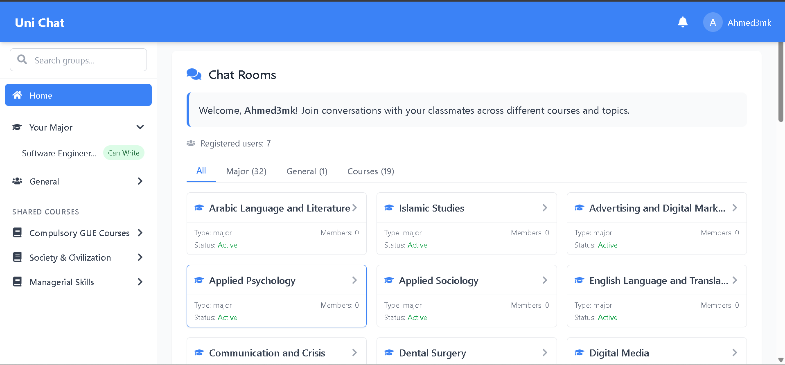

# Uni Chat App


---

## 🚀 Overview

**Uni Chat App** is a modern, university-focused group chat platform built with React, Firebase, and Tailwind CSS.  
It enables students and faculty to communicate in real time via group chats organized by **major**, **courses**, and **general topics**.

---

## 🖼️ Showcase



---

## 🌐 Live Demo

Access the deployed app here:  
👉 [https://uni-chat-app-vuuh.vercel.app/](https://uni-chat-app-vuuh.vercel.app/)

---

## 🎯 Features

- **Authentication & Security**
  - Register with email, password, display name, and university major
  - Email verification & password reset flows
  - Secure login/logout (Firebase Auth)
  - Profile management with image cropping & upload

- **Group Chat Rooms**
  - Auto-generated chat rooms for every major, all general topics, and each university course
  - Dynamic member counts for groups
  - Real-time messaging (Firestore listeners)
  - File sharing (images, documents, audio, video, compressed files)
  - Emoji picker & rich emoji support
  - Reply-to messages with preview
  - Message actions: copy, reply, delete (own messages)
  - Scroll-to-bottom and load more messages (pagination)
  - Group info sidebar: guidelines, description, members

- **Search & Navigation**
  - Fuzzy group search bar with autocomplete suggestions
  - Collapsible sidebar for groups, courses, and general rooms
  - Responsive design for mobile & desktop
  - Status bar showing current time (local/timezone) & user login

- **Notifications**
  - Real-time unread message counts per group
  - Total unread badge in header
  - Browser push notification support

- **Tech Stack**
  - React 19, React Router v6
  - Firebase Auth, Firestore, Storage
  - Tailwind CSS
  - Vite for fast development
  - Emoji Picker, React Icons, React Image Crop

---

## 📂 Directory Structure

```
uni-chat-app/
├── public/
│   ├── chat-icon.svg        # App icon for favicon and branding
│   ├── Showcase.png         # Screenshot of the app
│   └── ...                  # Other static assets
├── src/
│   ├── components/          # UI components (Chat, Auth, Groups, Layout, etc.)
│   ├── contexts/            # React context providers (AuthContext)
│   ├── data/                # Static data (majors, courses, etc.)
│   ├── hooks/               # Custom React hooks (useGroups, useDebounce, etc.)
│   ├── pages/               # Page-level views (Home, Profile, GroupChat, etc.)
│   ├── services/            # Firebase logic (storage, notifications, etc.)
│   ├── styles/              # CSS and Tailwind files
│   ├── utils/               # Utility functions (groupId, etc.)
│   ├── App.jsx
│   ├── main.jsx
│   └── index.css
├── .env                     # Firebase configuration (not committed)
├── package.json
├── tailwind.config.js
├── vite.config.js
└── README.md
```

---

## ⚡ Getting Started

### 1. Clone the Repository

```sh
git clone https://github.com/AhmedQw1/uni-chat-app.git
cd uni-chat-app
```

### 2. Install Dependencies

```sh
npm install
```

### 3. Configure Firebase

1. Create a Firebase project at [console.firebase.google.com](https://console.firebase.google.com/)
2. Copy your Firebase config into a `.env` file (refer to `.env.example`)

```env
VITE_FIREBASE_API_KEY=your-firebase-api-key
VITE_FIREBASE_AUTH_DOMAIN=your-project.firebaseapp.com
VITE_FIREBASE_PROJECT_ID=your-project-id
VITE_FIREBASE_STORAGE_BUCKET=your-project-id.appspot.com
VITE_FIREBASE_MESSAGING_SENDER_ID=your-messaging-sender-id
VITE_FIREBASE_APP_ID=your-app-id
VITE_FIREBASE_MEASUREMENT_ID=your-measurement-id
```

### 4. Start the Development Server

```sh
npm run dev
```

Open [http://localhost:5173](http://localhost:5173) in your browser.

---

## 🛠️ Customization

- **Edit Majors/Courses:**  
  Change or add majors and courses in `src/data/majors.js`.

- **Branding:**  
  Replace `public/chat-icon.svg` and update favicon as needed.

- **Theme:**  
  Customize colors and style via `src/styles/variables.css` and Tailwind config.

---

## 🏫 Use Case

- For university students and faculty to collaborate, share resources, and chat by major, course, or general interest.
- Can be adapted for other educational institutions or organizations needing structured, authenticated group chat.

---

## 🙏 Credits

- Built with [React](https://react.dev/), [Firebase](https://firebase.google.com/), [Tailwind CSS](https://tailwindcss.com/), [Vite](https://vitejs.dev/)
- Emoji Picker: [emoji-picker-react](https://github.com/ealush/emoji-picker-react)
- Cropper: [react-image-crop](https://github.com/DominicTobias/react-image-crop)
- Icons: [react-icons](https://react-icons.github.io/react-icons/)

---

## 📜 License

MIT

---

## 💬 Feedback & Contributions

- Found a bug(other than notifications cuz still under maintenance LOL) or have a feature request?  
  Feel free to open an issue or pull request!
